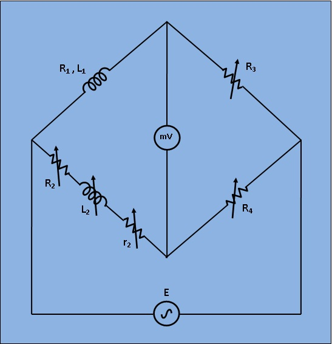

## Introduction

This bridge circuit measures an inductance by comparison with variable standard self inductance. The connections for balance condition is shown in Fig. 1.

***Fig 1: Circuit Diagram for Measurement of Self Inductance by Maxwell Bridge***

